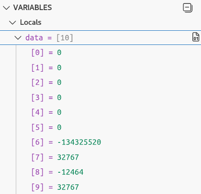
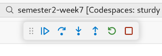
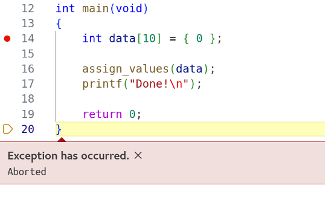

# Task 4: Debugging in VS Code

For this task, we will return to the crashing C program from Task 1 of
Session 1. We will try debugging this program in VS Code.

> [!NOTE]
> Make sure you've installed the C/C++ Extension Pack into VS Code before
> you begin this task!

1. Open `crash.c` in the VS Code editor. Hover the cursor over the left
   margin, to the left of the line numbers. You should see a pink dot appear,
   which tracks the movement of the cursor.

   

   Click on the dot when you are on line 14. It should become red and stay
   fixed to that line. This marks a breakpoint. Click on it again to remove
   it, then click once more to reestablish the breakpoint.

2. Choose *Debug C/C++ File* from the dropdown menu beside the Run/Debug
   button, at the top-right of the VS Code UI.

   

   This should initiate debugging. After a short delay, you should see
   program execution pause at line 14. A marker will appear in the margin
   and the line will be highlighted in yellow.

3. At the left of the VS Code UI, you should see the Debug panel, with
   sections showing

   - Local variables & CPU registers
   - Current watchpoints
   - The call stack
   - Current breakpoints

   Expand the `data` item under 'Locals'. You should see all of the elements
   of the array `data` listed.

   

   You might see some non-zero values here: remember that arrays allocated
   on the stack are not initialized for you!

4. You can use the controls at the top of the screen to interact with the
   program:

   

   Hover over each button to see a tooltip describing what it does. Note how
   the tooltip includes a keyboard shortcut in parentheses.

5. Use the relevant button or keyboard shortcut to Step Over line 14. You
   may see the contents of `data` change at this point; any values that
   weren't initially zero will now be zero. Those values will also be
   highlighted, to indicate that they changed recently.

6. Use the relevant button or keyboard shortcut to Step Into `assign_values()`.
   Notice how the call stack at the bottom of the Debug panel has been
   updated, and how the 'Locals' section contains entries for loop control
   variable `i` and function parameter `x`. The latter holds the address
   of the array `data` that was created in `main()`.

   Expand the 'CPU' section under 'Registers'. Observe closely the changes
   that occur in the various CPU registers as you repeatedly invoke Step
   Over. Here are a few things you should notice:

   - Register `rip` switches repeatedly between two different addresses.
     This is because `rip` is the **instruction pointer**, referencing the
     current CPU instruction. What you are seeing here is the CPU jumping
     back to execute another iteration of the `for `loop.

   - Compare the value in register `rdi` with the value of function parameter
     `x`. You should see the same memory address in both cases. This is
     because, on most Linux systems, register `rdi` is used to pass the first
     integer or pointer argument to a function.

   - General-purpose registers `rax`, `rcx` and `rdx` are used to perform the
     calculations needed by the loop body: `rcx` holds the result of `i + 1`;
    `rax` holds the result of squaring this value; and `rdx` holds the
     memory address being written to by the assignment operation.

7. Select `main()` from the 'Call Stack' section at the bottom of the Debug
   panel. This will allow you to easily examine the contents of the array
   `data`. Depending on exactly when you've done this, You will see that it
   holds some or all of the squares of the integers from 1 up to 10.

8. Finally, use the relevant button or keyboard shortcut to resume normal
   execution of the program. It should crash with a segmentation fault.
   Notice how the VS Code UI highlights this:

   

   You should also see a red warning label on the 'Call Stack' section of
   the Debug panel, and beneath that, a link that you can use to show
   more stack frames. If you click on this link, you'll see the C library
   calls involved in handling the error.

See the [VS Code documentation on debugging][vsc] for more information on
using this UI.

[vsc]: https://code.visualstudio.com/docs/cpp/cpp-debug
